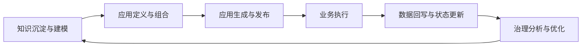

# P1.1 需求分析

更新时间：2026-04-02
关联 Issue：#1

## 1. 项目背景与问题陈述

本报告作为当前阶段的根输入文档，用于将既有分析与设计成果归并为可执行的业务需求定义。归并后的核心结论：

1. 产品定位
NodeTest 是知识驱动的定制应用生成系统，不是单一原型页。
2. 顶层产品形态
知识仓库 -> 软件工厂 -> 自定义软件终端 -> 统一状态回写。
3. 核心业务诉求
跨领域通用抽象、定义态优先、业务可配置、执行可追溯、结果可治理。
4. 当前关键缺口
业务用户优先级、总体业务目标和全阶段功能需求表达仍需统一。
5. 文档归并声明
原 `2026-03-28-四层核心模型说明` 与 `2026-03-28-三大模块内部抽象说明` 的核心内容已并入本稿。

## 2. 目标用户与核心使用场景

### 2.1 目标用户（按业务重要性与使用优先级排序）

1. 业务决策与治理角色（管理层、审计/合规）
关注流程效率、风险暴露、合规状态与治理闭环。
2. 一线业务操作者（审批员、运营人员、项目管理人员）
关注执行效率、反馈清晰、操作可追溯。
3. 业务应用设计者（流程负责人、咨询/实施团队）
关注通过组合配置快速生成业务应用。
4. 行业知识管理员（数字化中台、数据治理岗位）
关注知识对象维护、状态数据治理与模型演进。

### 2.2 典型商业场景

1. 上市公司内控/审批
预算申请、合同审批、付款执行、归档审计组合为内部治理应用。
2. 制造业运营协同
工单流转、异常上报、质量复检、责任追踪组合为生产协同应用。
3. 公共服务治理
事项受理、材料核验、节点审批、结果回执组合为服务治理应用。

### 2.3 公共服务治理场景使用路径（系统化示例）

以“园区企业开办服务”场景为例，业务方使用本系统的完整路径：

1. 在知识仓库沉淀要素
维护实体（企业、申请人、部门、材料）、事件（提交、退回、通过、补正）、规则（时限、完整性、前置依赖）和业务流程模板。
2. 在软件工厂选择业务素材
选择“企业开办”相关实体、事件、流程节点和规则集，确定适用组织范围。
3. 在软件工厂组装场景
将“受理 -> 初审 -> 并联审批 -> 结果回执”组合为一个可发布场景。
4. 配置角色表达
为窗口人员、审批人员、监管人员分别配置工作台卡片、快捷动作、流程透视和关系透视。
5. 生成定制终端
系统输出企业开办终端，形成申请入口、审批台、办理看板和治理看板。
6. 一线执行业务
窗口与审批人员在终端完成受理、补正、审批、回执，系统记录关键节点状态。
7. 统一回写仓库
终端操作统一回写知识仓库状态层，形成可追溯事件链。
8. 治理复盘与优化
管理层根据治理看板定位瓶颈节点、退回原因、超时环节，在软件工厂迭代规则并重新发布。

上述为业务场景，研发工作需将其转译为数据模型、交互流程和接口契约。

## 3. 应用总体目标与业务目标

### 3.1 应用总体目标（跨阶段）

1. 建设面向多行业的知识驱动型定制应用生成平台。
2. 支持“选要素 -> 组场景 -> 配表达 -> 生成应用定义”的标准化链路。
3. 支持终端执行结果统一回写仓库，形成定义-执行-回写-优化闭环。
4. 形成可迁移的通用抽象能力，而非绑定单一行业模板。

### 3.2 业务目标（产品化目标）

1. 将业务变更成本从改代码转为改配置和组合，提高交付速度。
2. 让业务执行数据统一沉淀，支撑分析、审计、治理和持续优化。
3. 形成标准化交付链路：需求定义 -> 应用生成 -> 运行执行 -> 治理反馈。

### 3.3 当前阶段非目标

1. 当前阶段不交付企业级全量能力（多租户、细粒度权限、审计中心）。
2. 当前阶段不完成跨系统正式集成（ERP、OA、BPM 等）。
3. 当前阶段不追求覆盖全行业全流程，先验证通用骨架可行性。

## 4. 全流程全阶段功能需求

### 4.1 业务全流程图

### 4.2 分阶段功能需求

1. P1 定义态与原型闭环
支持知识要素选择、工厂组合、输出结构展示的最小可演示闭环。
2. P2 仓库模型与工厂能力深化
完善状态域、对象模型、异构对象编排契约与统一回写语义。
3. P3 定义态增强
支持工作台卡片、快捷动作、临时流程和关系透视，提升定义可读性与可解释性。
4. P4 运行态闭环
支持会话推进、事件链路、终端回写、门禁校验与验收闭环。

### 4.3 跨阶段通用功能

1. 统一对象标识与关系管理。
2. 统一回写语义与一致性约束。
3. 全链路追溯与证据回链。
4. 面向业务用户的可解释输出与错误提示。

## 5. 非功能需求

1. 可理解性
业务术语一致，业务角色可读懂定义结果与执行结果。
2. 可追溯性
业务需求可映射到页面、接口、输出物与验证证据。
3. 可验证性
至少存在 1 条端到端业务链路可重复验证。
4. 可扩展性
对象类型和流程编排可扩展到更多行业场景。
5. 一致性
终端操作回写语义一致，避免多源数据冲突。

## 6. 约束与边界

1. 采用当前 NodeTest 仓库既有技术栈与目录结构。
2. 协作路径统一使用仓库相对路径，不使用本机绝对路径。
3. P1 聚焦业务定义态与最小联调闭环，不提前扩展复杂运行态机制。
4. 本文档以业务价值与需求定义为主，研发实现细节在 P1.2/P1.3 展开。

## 7. 关键风险与应对

1. 跨行业抽象可能过泛化或过行业化，影响复用性。
应对：采用多行业样例持续校正抽象边界。
2. 异构对象语义不统一，影响工厂编排稳定性。
应对：先固化最小对象分类与字段边界，再扩展类型。
3. 输出结构不规范会增加后续运行态兼容成本。
应对：建立统一输出结构约束与回写契约。
4. 需求文档若偏研发语言，业务评审效率会下降。
应对：坚持业务场景表达，并保留业务到研发映射链。

## 8. 对后续节点的输入映射

1. 输入给 P1.2 原型设计
基于本报告输出页面结构、交互步骤、接口映射与可视化流程。
2. 输入给 P1.3 模块实现
基于本报告输出接口实现边界、模块分工、联调路径与验证证据。

## 9. P1.1 完成标准

1. 文档覆盖背景、商业用户、商业场景、总体目标、全阶段需求、非功能、风险与边界。
2. 文档包含业务全流程图与全阶段功能需求，而非仅当前切片需求。
3. 文档可直接驱动 P1.2/P1.3，且不依赖聊天上下文补充。
4. 文档不包含临时评语或过程性批注，可直接进入评审与归档。

## 10. 核心模型与模块抽象（归并章节）

本章节归并原“四层核心模型说明”和“三大模块内部抽象说明”的关键定义，作为本需求文档正式组成。

### 10.1 四层核心模型

平台核心采用四层：

1. 标准知识层（Standard Knowledge）
2. 场景模型层（Scenario）
3. 表达模型层（Experience）
4. 构建流程层（Build Workflow）

四层关系：

1. 标准知识提供可复用业务素材
2. 场景模型组合素材形成应用语义容器
3. 表达模型将场景投影为角色化视图和交互
4. 构建流程指导用户完成“选知识 -> 组场景 -> 配表达 -> 触发生成”

### 10.2 业务流程与构建流程严格区分

1. 业务流程（Business Flow）
来自真实业务世界（审批流、职责流、事件流），属于知识仓库素材。
2. 构建流程（Build Workflow）
属于平台装配流程，描述用户如何搭建应用，不属于业务知识本体。

约束：

1. 构建流程不得反向写入知识层作为业务语义
2. 业务流程不得被误用为平台内部装配步骤

### 10.3 三大模块正式边界

1. 知识仓库
平台语义与状态真相层，承载知识对象和统一状态数据。
2. 软件工厂
装配与定义中枢，负责选择、编排、组合、约束、映射。
3. 自定义软件终端
输出与消费层，承接定义结果，支持执行交互并统一回写。

主链路：

`知识仓库 -> 软件工厂 -> 自定义软件终端 -> 统一状态回写`

### 10.4 软件工厂异构对象抽象

软件工厂内部对象天然异构，不能压扁为单一类型。典型对象：

1. 工作流 Skill/规则对象
2. 结构模板与界面模板对象
3. 组件与框架对象
4. 连接器与运行支撑对象（如消息队列适配能力）

统一建模方法：职责分层 + 多维属性。建议维度：

1. `kind`（职责类别）
2. `form`（存在形态）
3. `stage`（作用阶段）
4. `io_contract`（输入输出契约）
5. `dependency_contract`（依赖关系）
6. `replaceability`（可替换边界）

### 10.5 职责边界约束

1. 知识仓库不负责页面布局、终端个性化表达和发布逻辑
2. 场景层不负责视觉样式和前端组件树实现
3. 表达层不新增业务实体、不篡改知识定义和业务规则
4. 终端层不吞并工厂装配职责

### 10.6 当前阶段验证重点

当前优先验证闭环：

`标准知识 -> 场景 -> 表达`

暂不优先验证：

1. 原始资料到标准知识的完整自动抽取能力
2. 标准知识到生产级代码生成与部署能力
