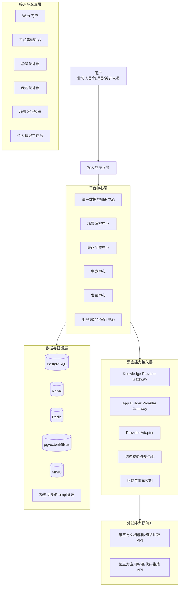
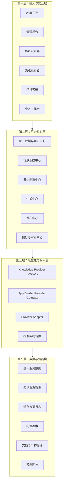
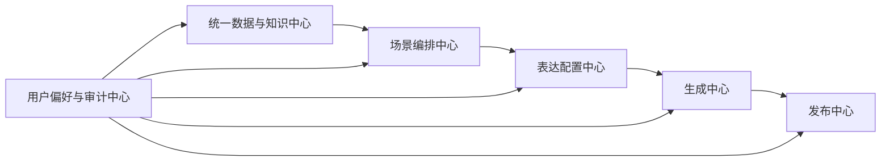
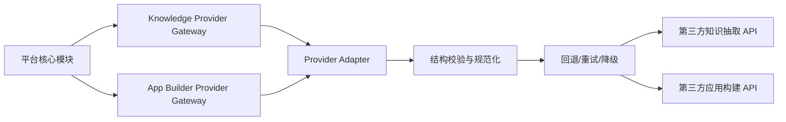
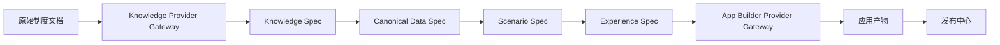
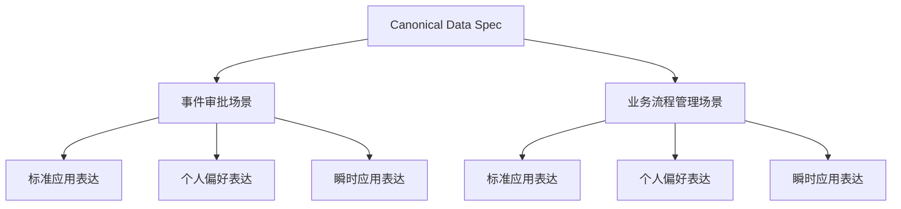
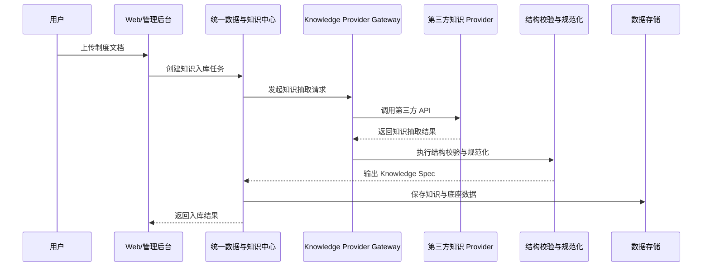
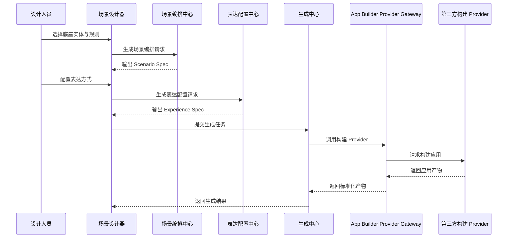
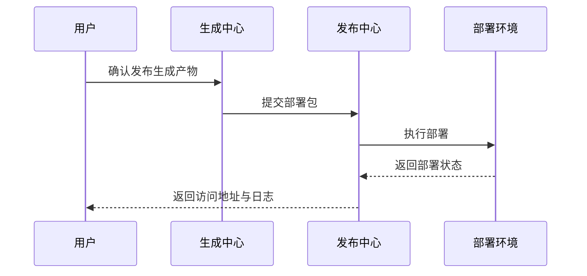

# 原型系统模块架构图

## 1. 文档目标

本文档基于《建设方案.md》整理原型系统的模块架构，用于明确平台核心模块、黑盒能力接入边界、模块之间的数据流转关系，以及原型阶段的实现重点。

本架构遵循以下原则：
- 高内聚、低耦合
- 统一数据底座支撑多场景复用
- 场景层与表达层解耦
- 知识生成与应用构建能力可黑盒接入
- 各模块通过标准数据契约通信

---

## 2. 原型系统总体模块架构

---

## 3. 分层架构图

---

## 4. 核心模块拆解图

### 4.1 平台核心模块结构

### 4.2 平台核心模块职责说明

#### 4.2.1 统一数据与知识中心
负责平台统一语义底座的沉淀与治理，是“一套数据支撑多个场景”的核心。

包含子能力：
- 统一实体管理
- 统一关系管理
- 规则管理
- 流程语义管理
- 知识检索
- 条款追溯
- 版本管理

输出标准：
- Canonical Data Spec
- Knowledge Spec

#### 4.2.2 场景编排中心
负责将统一数据与知识底座装配成具体业务场景。

包含子能力：
- 场景定义
- 动作装配
- 规则绑定
- 权限映射
- API 能力编排
- 场景版本管理

输出标准：
- Scenario Spec

#### 4.2.3 表达配置中心
负责将场景投影为不同应用表达方式。

包含子能力：
- 标准应用表达配置
- 瞬时应用表达配置
- 个人偏好表达配置
- 布局配置
- 组件树配置
- 交互映射配置

输出标准：
- Experience Spec

#### 4.2.4 生成中心
负责根据标准契约生成应用产物。

包含子能力：
- 生成任务管理
- 生成策略选择
- 模板管理
- 黑盒生成能力调用
- 产物校验
- 构建验证

输入标准：
- Canonical Data Spec
- Knowledge Spec
- Scenario Spec
- Experience Spec

输出产物：
- 前端工程
- 后端工程
- 配置文件
- 部署脚本
- 接口文档

#### 4.2.5 发布中心
负责将生成结果部署到目标环境。

包含子能力：
- 环境配置
- 数据初始化
- 部署执行
- 发布状态回传
- 日志查看
- 回滚控制

#### 4.2.6 用户偏好与审计中心
负责个性化表达与全链路审计治理。

包含子能力：
- 用户偏好管理
- 工作台模板管理
- 操作审计
- 知识变更审计
- 生成审计
- 发布审计
- 第三方 Provider 调用审计

---

## 5. 黑盒能力接入架构图

### 5.1 黑盒接入总体结构

### 5.2 黑盒接入原则

- 第三方能力仅作为能力提供方，不直接进入平台核心域模型
- 所有第三方返回结果必须经过标准化转换
- 所有 Provider 必须纳入审计与版本治理
- 平台允许替换 Provider，不允许替换平台契约

### 5.3 黑盒接入模块职责

#### Knowledge Provider Gateway
负责调用第三方文档解析、知识抽取、制度理解能力。

输入：
- 原始文档
- 文档元数据
- 抽取任务类型
- 《基础资料生成领域知识输入规范.md》定义的抽取约束

输出：
- 标准化 Knowledge Spec
- 文档切片层与来源追溯信息

#### App Builder Provider Gateway
负责调用第三方低代码构建、页面生成、代码生成能力。

输入：
- Scenario Spec
- Experience Spec
- 技术栈约束

输出：
- 标准化应用产物

#### Provider Adapter
负责屏蔽不同厂商的调用协议差异。

职责：
- 请求封装
- 返回解包
- 错误码映射
- 版本差异兼容

#### 结构校验与规范化
负责保证黑盒输出满足平台内部契约。

职责：
- JSON Schema 校验
- 字段映射
- 缺省值补全
- 结构合法性检查

#### 回退与重试控制
负责提升第三方依赖的不确定性容忍度。

职责：
- 重试机制
- 降级策略
- 多 Provider 切换
- 超时与失败控制

---

## 6. 数据契约驱动架构图

### 6.1 契约关系说明

#### Knowledge Spec
描述制度、条款、角色、规则、流程等知识结构，是知识黑盒的标准输出。
原型阶段其详细结构以《基础资料生成领域知识输入规范.md》为准，并要求同时输出文档切片层、来源引用与校验信息。

#### Canonical Data Spec
描述统一业务数据结构，是平台底座统一建模的核心。

#### Scenario Spec
描述场景能力装配结果，是场景层对统一数据与规则的编排输出。

#### Experience Spec
描述场景的表达方式，是多样化应用表达的直接输入。

#### Provider Contract
用于规范黑盒接入协议，确保第三方能力可替换、可审计、可治理。

---

## 7. 场景与表达解耦架构图

### 7.1 设计含义

该结构用于验证两个关键目标：
- 同一套底座对象是否能够支撑多个业务场景
- 同一个业务场景是否能够支持多种表达方式

### 7.2 原型阶段建议验证组合

#### 场景一：事件审批
建议验证：
- 标准审批应用
- 高管偏好摘要视图
- 临时审批处理页

#### 场景二：业务流程管理
建议验证：
- 标准流程管理应用
- 流程负责人工作台
- 瞬时流程观察页

---

## 8. 原型关键模块交互时序图

### 8.1 知识入库时序

### 8.2 场景构建与表达生成时序

### 8.3 部署时序

---

## 9. 原型阶段建议重点实现的模块优先级

### 第一优先级
- 统一数据与知识中心
- 场景编排中心
- 表达配置中心
- Knowledge Provider Gateway
- App Builder Provider Gateway

### 第二优先级
- 生成中心
- 发布中心
- 用户偏好与审计中心

### 第三优先级
- 瞬时应用表达增强
- 多 Provider 智能路由
- 更复杂的回退与降级策略

---

## 10. 架构结论

原型系统的模块架构应以平台核心能力为中心，而不是以解析算法或生成算法为中心。

因此，原型架构的关键结论如下：

1. 平台核心是统一数据底座、场景编排、表达配置与治理能力
2. 知识生成与应用构建可以作为黑盒能力接入，但必须受平台标准契约约束
3. 一套数据支撑多个场景，必须依赖 Canonical Data Spec 稳定存在
4. 一个场景支撑多种表达，必须依赖 Scenario Spec 与 Experience Spec 解耦
5. 第三方能力只能替代实现，不能替代平台标准、治理与审计

---

## 11. 建议后续衔接文档

建议在本文档基础上继续补充以下文档：
- Canonical Data Spec.md
- Scenario Spec.md
- Experience Spec.md
- Knowledge Provider Contract.md
- App Builder Provider Contract.md
- 事件审批与业务流程管理双场景详细设计.md
